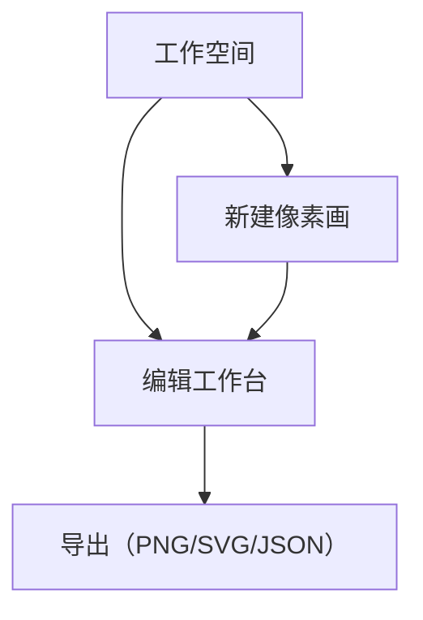
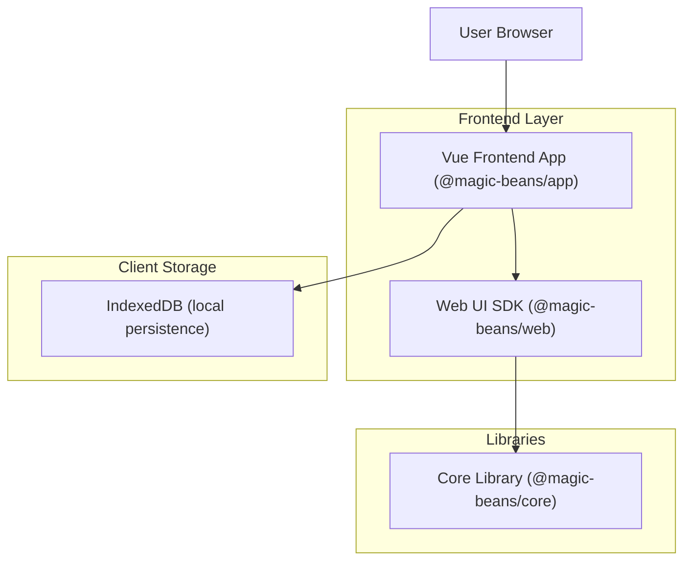

## 1. Product Overview
像素画（拼豆）项目管理工作空间与编辑工作台，面向桌面优先的创作与导出场景。
目标：提高项目管理与编辑效率，提供可视化工具栏、色板与颜色用量统计，支持本地持久化与导出。

## 2. Core Features

### 2.1 User Roles
本产品为单用户应用，无需角色区分与注册登录。

### 2.2 Feature Module
我们的产品包含以下关键页面：
1. **工作空间（首页）**：左侧导航栏与“新建像素画”按钮、搜索输入、项目卡片网格、删除操作、排序/过滤。
2. **编辑工作台**：顶部工具栏（面包屑、缩放百分比、尺寸标签、导出按钮）、工具图标行（选择/手型、画笔、橡皮、吸管、矩形）、左侧缩略图列表、右侧画笔与色板面板、中心像素画布（网格、缩放、平移）、底部颜色用量统计与撤销/重做。

### 2.3 Page Details
| Page Name | Module Name | Feature description |
|-----------|-------------|---------------------|
| 工作空间（首页） | 左侧导航与新建 | 显示“新建像素画”按钮；点击后创建并跳转到编辑工作台；提供“全部文件”入口。 |
| 工作空间（首页） | 搜索与过滤 | 输入关键字即时过滤卡片；支持尺寸与时间排序切换。 |
| 工作空间（首页） | 项目卡片网格 | 显示缩略图、标题、创建/更新时间、尺寸标签；支持点击进入编辑；支持删除单卡片。 |
| 编辑工作台 | 顶部工具栏 | 显示面包屑“我的文件/项目名”；显示缩放百分比与尺寸标签；提供“导出”按钮（PNG/SVG/JSON）。 |
| 编辑工作台 | 工具图标行 | 提供选择/手型、画笔、橡皮、吸管、矩形；显示撤销/删除快捷操作；支持快捷键。 |
| 编辑工作台 | 左侧缩略图 | 显示帧/图层缩略图；支持选中、高亮与新增占位“+”。 |
| 编辑工作台 | 右侧工具面板 | 显示画笔大小滑条“画笔大小: NxN”；提供色板选择与当前选中颜色高亮。 |
| 编辑工作台 | 像素画布 | 显示网格（拼豆孔位感）；支持缩放、平移；支持画笔、橡皮、矩形填充；吸管取色；显示坐标尺标。 |
| 编辑工作台 | 底部统计与控制 | 显示颜色用量芯片（代码与数量）；提供开关、排序（数量/颜色）、撤销/重做；显示当前配色方案。 |

## 3. Core Process
- 新建项目：在工作空间点击“新建像素画”→弹出尺寸选择或使用默认值→创建项目→跳转编辑工作台→开始绘制→本地持久化保存。
- 打开/编辑项目：在工作空间搜索/选择项目卡片→进入编辑工作台→使用工具栏/色板进行绘制→颜色用量动态统计→随时导出（PNG/SVG/JSON）。
- 删除项目：在工作空间卡片右下角点击“删除”→确认→移除并更新列表。

## 4. User Interface Design
### 4.1 Design Style
- 主色：#3B82F6（蓝，按钮与主操作）；辅色：#22C55E（绿，尺寸/状态标签）；中性色：#111827 / #6B7280 / #E5E7EB。
- 按钮：圆角、轻阴影、悬停提升；主要按钮为实体色，次要按钮为浅色边框。
- 字体：系统 UI（-apple-system, system-ui, "PingFang SC"），标题 18–20px，正文 14–16px，标签 12–14px。
- 布局：
  - 工作空间：左侧导航 + 右侧卡片网格（卡片圆角、缩略图、信息区）
  - 编辑工作台：顶部工具栏 + 中心画布 + 左缩略图 + 右工具面板 + 底部统计条
- 图标/Emoji：线性矢量图标（24px），色块芯片使用浅色背景+有色边框，选中态高亮描边。
- 图标系统：统一使用 Iconify（@iconify/vue）+ 自定义 `<AppIcon>` 组件；图标名称遵循 `mdi:` / `lucide:` / `ph:` 等前缀；支持按需加载与缓存，所有交互图标需带 `aria-label`。

### 4.2 Page Design Overview
| Page Name | Module Name | UI Elements |
|-----------|-------------|-------------|
| 工作空间（首页） | 顶部搜索区 | 圆角输入框、放大镜图标（`mdi:magnify`）、轻边框；搜索占位“搜索文件...”。 |
| 工作空间（首页） | 项目卡片 | 缩略图、标题（黑）、日期（灰小字）、尺寸标签（绿胶囊）、删除图标（`mdi:delete-outline`）；卡片悬停阴影。 |
| 编辑工作台 | 顶部工具栏 | 面包屑（`mdi:chevron-right` 间隔）、缩放百分比（灰胶囊、`mdi:magnify-plus-outline`/`mdi:magnify-minus-outline`）、尺寸标签（绿胶囊）、“导出”主按钮（蓝、`mdi:download`）。 |
| 编辑工作台 | 工具图标行 | 选择/手型（`mdi:cursor-move`）、画笔（`mdi:brush`）、橡皮（`mdi:eraser`）、吸管（`mdi:eyedropper`）、矩形（`mdi:rectangle-outline`）、撤销（`mdi:undo`）、删除（`mdi:delete`）；无文字、悬停提示。 |
| 编辑工作台 | 右侧工具面板 | “画笔大小: NxN”标签 + 滑条（`mdi:gesture-tap-button`）；纵向色板；当前色高亮边框。 |
| 编辑工作台 | 底部统计 | 颜色用量芯片（代码+数量，`mdi:palette`），排序按钮（数量/颜色，`mdi:sort`），开关样式为蓝色胶囊。 |

### 4.3 Responsiveness
桌面优先；移动端自适应（面板折叠、触摸优化：画布拖拽、缩放手势）；重要交互（绘制、吸管、撤销）提供触控反馈。

---

# 技术架构（@magic-beans/app 使用 @magic-beans/web，且遵守 app→web→core 依赖约定）

## 1.Architecture design

## 2.Technology Description
- Frontend: Vue@3.5 + TypeScript@5.7 + Vite@6 + Pinia@2 + Vue Router@4 + UnoCSS + Naive UI + ESLint@9 + Vitest
- Initialization Tool: vite-init
- Backend: None（仅本地存储 IndexedDB；不引入服务器端与外部服务）
- Internal Packages: @magic-beans/app 仅依赖 @magic-beans/web；@magic-beans/web 仅依赖 @magic-beans/core；@magic-beans/core 不依赖其余两个包。
- Icon System: 仅在 @magic-beans/app 使用 @iconify/vue；@magic-beans/web 与 @magic-beans/core 不引入图标依赖；在 app 中通过 `<AppIcon name="mdi:home"/>` 统一封装与调用。

## 3.Route definitions
| Route | Purpose |
|-------|---------|
| /workspace | 工作空间（首页）：显示项目卡片网格、搜索与新建、删除、排序/过滤 |
| /editor/:id | 编辑工作台：绘制工具、色板、缩放平移、撤销重做、导出 |
| / | 重定向到 /workspace |

## 4.API definitions
无（不包含后端服务）。

## 5.Server architecture diagram
无（不包含后端服务）。

## 6.Data model
无（不包含服务器数据库；使用 IndexedDB 以键值与对象存储进行本地持久化）。