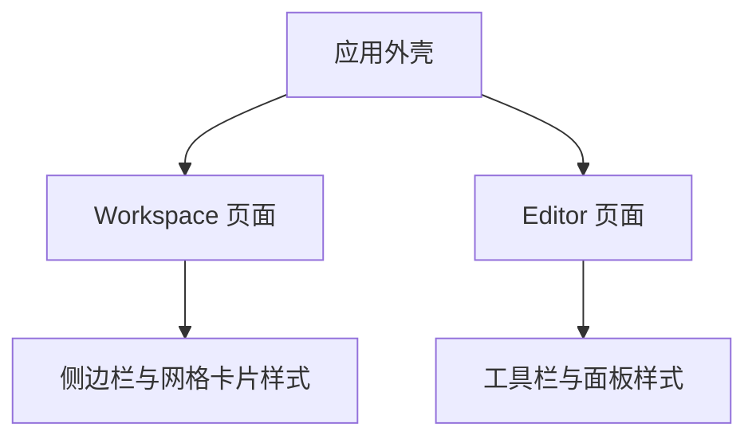

## 1. Product Overview
针对当前页面“字体不够美观、icon 不够美观、背景为纯黑”的问题，制定统一的桌面优先视觉规范与实施方案，用于 Workspace 与 Editor 两个核心页面以及全局应用外壳。
- 目标：提升可读性与一致性，建立可复用的字体系统、图标规范与分层背景主题。

## 2. Core Features

### 2.1 User Roles
不区分用户角色，本次仅涉及视觉与样式层面的统一。

### 2.2 Feature Module
我们的视觉优化涉及以下主要页面与模块：
1. **应用外壳（全局样式与主题）**：字体系统（字体栈、字号层级、行高）、分层背景与 surface 颜色、Icon 使用规范（仅通过 AppIcon）。
2. **Workspace 页面**：侧边栏与主内容网格的排版规范、标题/正文样式、图标尺寸与交互状态颜色、卡片与面板的 surface 层级。
3. **Editor 页面**：顶部工具栏/左侧工具栏/右侧面板/画布区域的文字与图标统一、工具图标的 hover/active/disabled 状态色、背景分层与对比度。

### 2.3 Page Details
| Page Name | Module Name | Feature description |
|-----------|-------------|---------------------|
| 应用外壳 | 字体系统（Typography） | 设定中文、英文字体栈；定义 H1–H6、Body、Caption 的字号与行高；为容器添加全局字体类；正文默认 14–16px、行高≥1.6，以保证阅读舒适。 |
| 应用外壳 | 图标系统（Icon via AppIcon） | 统一通过 AppIcon 使用 Iconify；规范尺寸刻度（16/20/24/32）；定义默认色与状态色（hover/active/disabled）；严禁页面/组件直接引入 Iconify。 |
| 应用外壳 | 背景与 Surface | 将纯黑背景替换为更柔和的深色主题（建议 #0E1116 或 #0B1220）；定义 surface-1/2/3 的分层颜色；保证正文与背景对比度≥4.5。 |
| Workspace | 布局与排版 | 侧边栏与网格卡片采用统一字体与色彩；卡片标题使用中等级标题样式；图标尺寸统一为 20/24px；hover 状态色不过度饱和，active 状态明确但不刺眼。 |
| Workspace | 空/加载/错误状态 | 空状态文案与插图可读；加载使用轻量动画；错误提示采用中性高对比度颜色并清晰表达问题。 |
| Editor | 工具栏与面板 | 顶部/侧边/右侧面板的图标与文字一致；工具图标 hover/active/disabled 的颜色与透明度统一；表面层级区分明显避免与画布混淆。 |
| Editor | 画布与背景 | 画布周围背景采用 surface-1，工具面板使用更高层级 surface；维持整体对比度，避免视觉疲劳。 |

## 3. Core Process
- 全局样式应用流程：应用启动时加载字体栈与 CSS 变量（颜色/字号），并为根容器添加背景与字体类。AppIcon 组件承担所有图标渲染，页面不直接引入 Iconify。
- 页面视觉一致性流程：Workspace 与 Editor 共享 typography、icon、surface 规范；各模块仅在容器上切换层级与密度，不做独立主题化。

## 4. User Interface Design
### 4.1 Design Style
- 主题色（建议）：
  - Primary: #3B82F6（用于强调与主按钮）
  - Secondary: #22C55E（用于成功与次强调）
  - Neutral: #9CA3AF（用于说明文字与弱提示）
  - Background (Base): #0E1116 或 #0B1220
  - Surface:
    - surface-1: #111827（主内容区）
    - surface-2: #0F172A（次级面板）
    - surface-3: #0B1220（高层级面板/浮层）
- 按钮风格：圆角、扁平化，状态色清晰，禁用态降低饱和度与亮度。
- 字体与字号：
  - 中文：Noto Sans SC, system-ui, -apple-system, BlinkMacSystemFont
  - 英文：Inter, system-ui, -apple-system, BlinkMacSystemFont
  - 正文：14–16px、行高 1.6；标题层级 H1–H6 递进缩放。
- 布局风格：卡片化、顶部导航与侧边面板分层清晰；容器采用统一的 padding 与间距刻度。
- Emoji/Icon 建议：Icon 使用 AppIcon 统一输出；尺寸 20/24px 为默认；建议线性图标，避免过度复杂的填充样式。

### 4.2 Page Design Overview
| Page Name | Module Name | UI Elements |
|-----------|-------------|-------------|
| 应用外壳 | 全局样式 | Body 字体与行高类、背景与 surface 类、CSS 变量（颜色/字号/间距）、AppIcon 默认尺寸与颜色。 |
| Workspace | 侧边栏与网格 | 侧边栏采用较深 surface；网格卡片使用中性浅边框与阴影；卡片标题/副标题字号与行高统一。 |
| Editor | 工具栏与面板 | 工具栏使用 20/24px 图标；右侧面板采用 surface-2；状态色在 hover/active/disabled 下有明显层级变化。 |

### 4.3 Responsiveness
桌面优先（Desktop-first），对移动端进行自适配；触控交互在 Editor 工具区作轻量优化（更大点击区域与更明确的激活态）。
