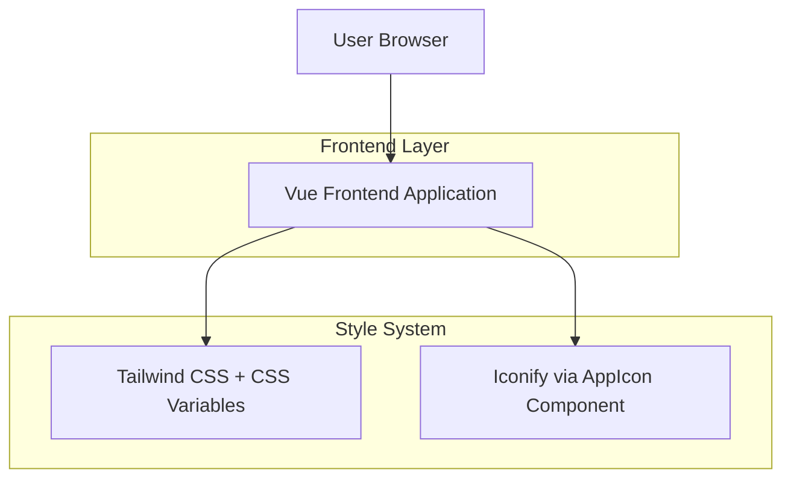

## 1.Architecture design

## 2.Technology Description
- Frontend: Vue@3 + tailwindcss@3 + vite + @iconify/vue
- Initialization Tool: vite-init
- Backend: None

说明：本次仅涉及前端视觉层面的统一（字体、图标、背景与 surface），不引入后端或外部服务；图标使用统一 AppIcon 组件，页面/组件不得直接引入 Iconify。

## 3.Route definitions
| Route | Purpose |
|-------|---------|
| /workspace | 工作空间页面，展示项目列表卡片与侧边栏，应用统一的字体与图标规范 |
| /editor/:id | 编辑器页面，工具栏与面板统一使用图标与背景分层规范 |

## 4.API definitions (If it includes backend services)
无后端服务，不涉及 API。

## 5.Server architecture diagram (If it includes backend services)
无后端服务，不涉及服务器架构。

## 6.Data model(if applicable)
不涉及数据库模型。
