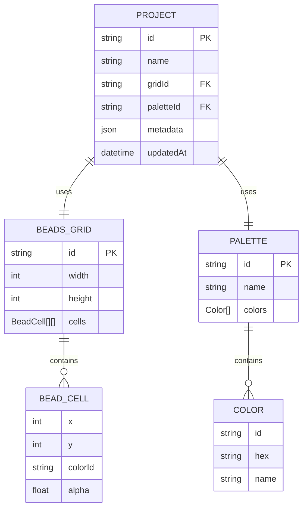

# Magic Beans App - 图片导入与编辑 技术架构

## 1. 架构总览
```mermaid
graph TD
    A[用户] -->|文件选择/拖拽| B[app: ImportDialog]
    B --> C[core: ImageConverter]
    C -->|BeadsGrid| D[web: PixiRenderer]
    D -->|InteractionEvents| E[web: ToolManager]
    E -->|apply(grid)| C
    E -->|HistorySnapshot| F[app: editorStore]
    F -->|persist| G[(IndexedDB)]
    F -->|export| H[PNG/JSON]

    subgraph packages/core
        C
    end
    subgraph packages/web
        D
        E
    end
    subgraph packages/app
        B
        F
    end
```

## 2. 模块职责
| 模块 | 职责 | 对外接口 |
|------|------|----------|
| core/ImageConverter | 像素→珠子颜色映射、抖动、参数处理 | `convertImageToGrid(imageBitmap, opts): BeadsGrid` |
| core/Palette | 内置调色盘、自定义上传、最近色查找 | `findClosestColor(rgb, palette): Color` |
| web/PixiRenderer | 渲染 BeadsGrid、网格线、选区高亮 | `render(grid, options)`, `zoomTo(percent)` |
| web/ToolManager | 工具状态机、事件分发、历史栈 | `setActiveTool(tool)`, `undo()`, `redo()` |
| app/ImportDialog | 文件选择、参数面板、实时预览 | Vue 组件；emit `applyConversion(grid)` |
| app/editorStore | 全局状态：grid、palette、tool、history | Pinia；actions: `importImage`, `applyTool`, `exportProject` |

## 3. 数据模型


## 4. 关键接口定义
### 4.1 转换参数
```ts
interface ConvertOptions {
  size: 16 | 32 | 64;
  palette: Palette | 'builtin16' | 'builtin32';
  dither: 'none' | 'floyd-steinberg';
  brightness: number; // -50~+50
  contrast: number;   // -50~+50
  scaleMode: 'cover' | 'contain';
}
```

### 4.2 工具接口
```ts
interface ITool {
  name: string;
  cursor: string;
  snapToGrid: boolean;
  onPointerDown(evt: ToolEvent): void;
  onPointerMove(evt: ToolEvent): void;
  onPointerUp(evt: ToolEvent): void;
  apply(grid: BeadsGrid, params: ToolParams): BeadsGrid;
}
```

### 4.3 历史管理
```ts
interface HistoryManager {
  push(grid: BeadsGrid): void;
  undo(): BeadsGrid | null;
  redo(): BeadsGrid | null;
  clear(): void;
  readonly canUndo: boolean;
  readonly canRedo: boolean;
}
```

## 5. 性能与内存策略
- **离屏 Canvas**：在 Web Worker 中完成像素采样与量化，避免阻塞主线程
- **分块渲染**：>32×32 时采用 Tile 渲染，视口外 Tile 延迟加载
- **历史栈压缩**：存储差异快照（delta），单步内存占用 ≤ 5 % 总网格
- **节流交互**：pointermove 16 ms 节流；工具应用 32 ms 防抖
- **内存上限**：原图转换后释放 ImageBitmap；历史栈最大 100 步，超限自动淘汰最远记录

## 6. 错误处理
| 场景 | 用户提示 | 降级策略 |
|------|----------|----------|
| 文件格式不支持 | Toast：“仅支持 PNG/JPG” | 清空选择，保持原网格 |
| 文件过大 (>5 MB) | Toast：“文件 ≤ 5 MB” | 同上 |
| 分辨率超限 | Toast：“分辨率 64~4096” | 同上 |
| 转换失败 | Toast：“转换失败，请重试” | 回退到上次有效网格 |
| IndexedDB 写入失败 | Console 错误 + 静默落盘 localStorage | 下次启动提示“本地存储受限” |

## 7. 测试策略
### 7.1 单元测试（core）
- 颜色映射：加权 RGB 距离、Gamma 校正边界
- 抖动效果：Floyd-Steinberg 与 None 对比像素误差
- 参数边界：16×16、64×64、极端亮度/对比度

### 7.2 集成测试（web）
- ToolManager：工具切换、历史栈 100 步压力、undo/redo 一致性
- PixiRenderer：zoomTo 同步、选区渲染、Tile 边界

### 7.3 UI 测试（app）
- ImportDialog：文件选择→参数变更→applyConversion 事件
- editorStore：importImage 触发历史记录；exportProject 文件内容断言
- 组件快照：工具栏、参数面板、导出弹窗

### 7.4 手动验收
- 桌面 1920×1080：导入 4K 图→64×64→导出 PNG 正常
- 移动 375×812：侧边栏折叠→工具可用→无水平滚动
- 性能：Chrome DevTools 6x CPU 节流下 64×64 交互 FPS ≥ 45

## 8. 部署与兼容
- 浏览器：Chrome ≥ 96、Edge ≥ 96、Firefox ≥ 94、Safari ≥ 15
- 移动端：iOS Safari ≥ 15、Chrome Android ≥ 96
- 构建：Vite 生产打包；core/web 作为 workspace 依赖本地链接；输出 source-map 供 Sentry 上报
- CDN：PixiJS 使用 npm 包 bundled，不额外外链；字体与图标走项目现有 CDN 策略

## 9. 后续扩展点
- Web Worker 多线程转换大图片
- 服务端云函数提供更高质量量化（k-means 聚类）
- 调色盘社区分享与评分
- 动画帧时间轴与 GIF 导出